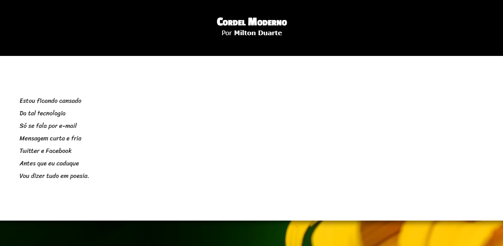
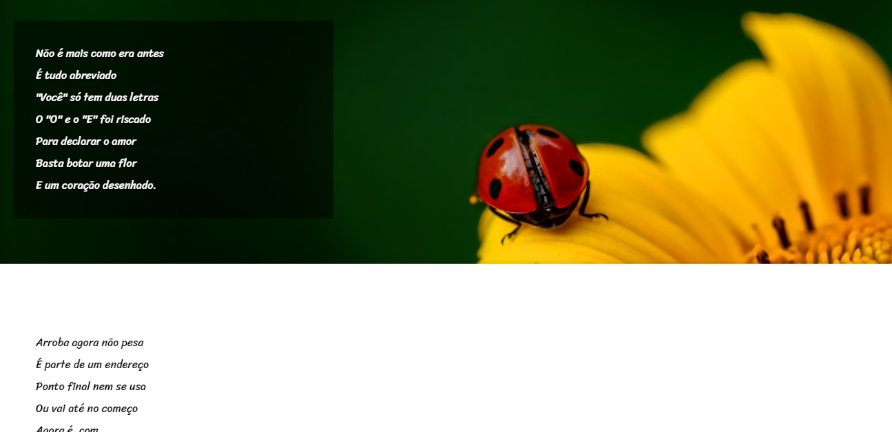
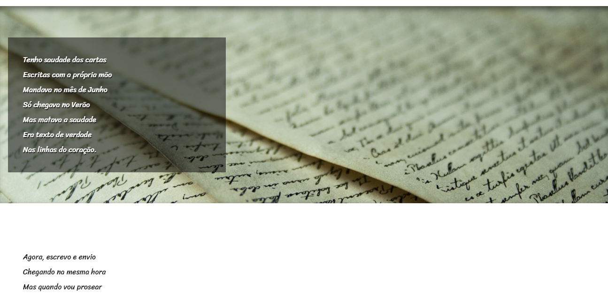
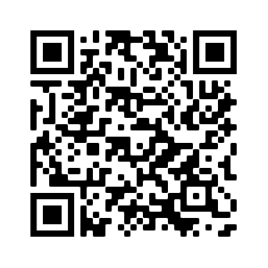

<h1>🖖 Olá, como vai?   <em>🖖 Hi, are you ok?</em></h1>
<h4>Este e mais um projeto desenvolvido nas aulas do <a href="https://www.cursoemvideo.com">Curso em Video.</a> Desta vez, fizemos um site de um cordel do autor <a href="https://www.recantodasletras.com.br/poesias/3186743">Milton Duarte</a> que utilizamos para treinar o efeito parallax em fotos de fundo. Espero que gostem, fiquem a vontade para dar uma olhada.

 <em>This is one more project built on the class of the <a href="https://www.cursoemvideo.com">Curso em Video.</a> This time, we did a website from a cordel of the author <a href="https://www.recantodasletras.com.br/poesias/3186743">Milton Duarte</a> that we use to practice the parallax effect on background photos. I hope you like it, feel free to take a look.</em>
</h4>

 
<h3>📸 Algumas fotos do projeto:   <em>📸 Some photos of the project:</em></h3>
 

 

<h3>Link do projeto e QR code para você dar uma olhada:   <em>Link of the project and QR code for you to view:</em></h3>
 
<h3><a href="https://hugocamposarimathea.github.io/projeto-cordel/">👉 Clique aqui 👈   <em>👉 Click here to go 👈</em></a></h3>
 

 

<h3>📧 Quer entrar em contato comigo?   📧 If you want to talk to me, send me an e-mail:</h3>

        
         

